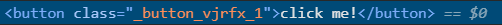

# Notes

## CSS druhy

- external
- module
- internal

### external 

- klasicky separatni .css file

*př: Card*

### module

- class name bude mit unikatni ID

*př: Button* 

### internal

- css file přímo v module

*př: h1 v Header*

## props

*viz. Student module*

- key=value 
- slouzi k **posilani dat** **z parent** componentu **do child** componentu

### proTypes

- ověŕení typu propu *string, number, bool*
- vypíše do konzole error s očekávaným typem

### default props

